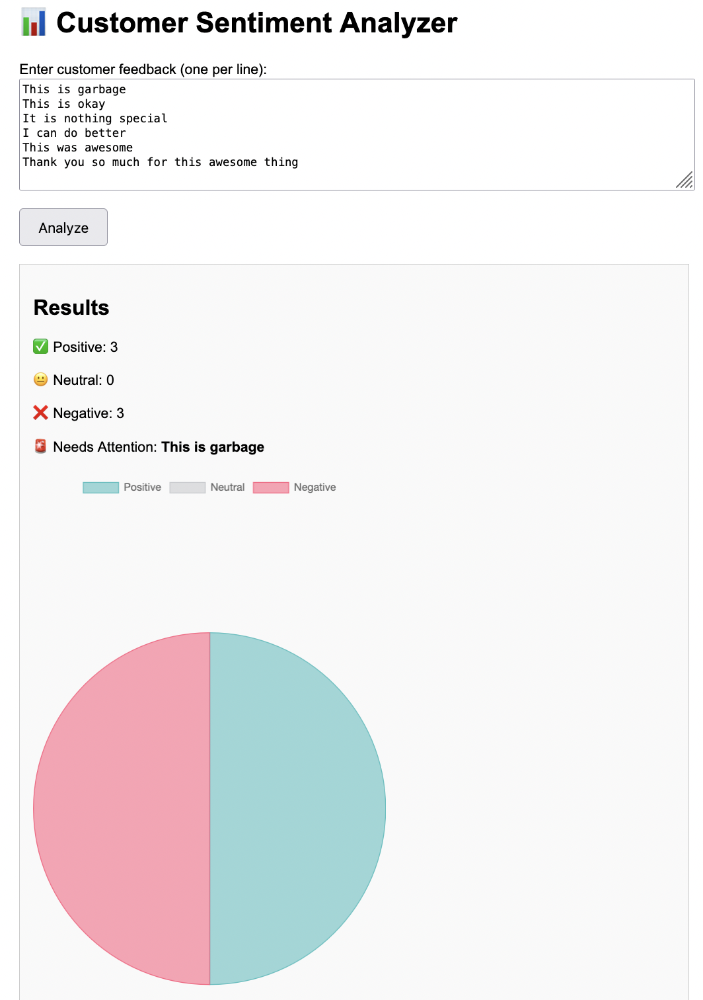

# 📊 Customer Sentiment Analyzer

A Spring Boot application that analyzes customer feedback using Hugging Face’s sentiment analysis model (`distilbert-base-uncased-finetuned-sst-2-english`).  
It provides a simple **web UI (Thymeleaf)** and **REST API** for classifying text into **Positive, Negative, or Neutral** sentiments.

---

## 🚀 Features
- REST API endpoint (`/sentiment/analyze`) for JSON input
- Web UI built with Thymeleaf
- Integration with Hugging Face Inference API
- Visual feedback chart (Pie Chart via Chart.js)
- Highlights the first negative comment as `Needs Attention`

---

## 🛠 Tech Stack
- **Java 17+**
- **Spring Boot 3**
- **Thymeleaf** (for frontend)
- **WebFlux (WebClient)** (for API calls)
- **Chart.js** (for visualization)

---

## ⚡ Setup

1. Clone the repo:
   ```bash
   git clone https://github.com/mayowa2133/customer-sentiment-analyzer.git
   cd customer-sentiment-analyzer


2. Add your Hugging Face API token in `application.properties`:

   ```properties
   huggingface.api.url=https://api-inference.huggingface.co/models/distilbert/distilbert-base-uncased-finetuned-sst-2-english
   HF_API_TOKEN=your_hugging_face_token_here
   ```

   👉 Make sure `application.properties` is in `.gitignore` (already set up).

3. Run the app:

   ```bash
   mvn spring-boot:run
   ```

4. Visit:

   * UI: [http://localhost:8080](http://localhost:8080)
   * API: `POST /sentiment/analyze` with body:

     ```json
     {
       "messages": ["This app is awesome", "Customer service was terrible"]
     }
     ```

---

## 📸 Demo



---

## 📂 Project Structure

```
customer-sentiment-analyzer/
├── src/main/java/com/mayowa/sentiment/...
├── src/main/resources/
│   ├── application.properties   # (ignored in git)
│   ├── templates/index.html     # UI
├── images/demo.png              # screenshot
├── pom.xml
└── README.md
```

---

## ✅ Example Output

### Input:

```
This is awesome  
This is terrible  
It’s okay  
```

### Output:

```json
{
  "positive": 1,
  "neutral": 1,
  "negative": 1,
  "needsAttention": "This is terrible"
}
```

---

## 🔒 Security Note

* Your Hugging Face API token should **never be committed**.
* Always keep it in `application.properties` (which is `.gitignore`d).
* A `application.properties.example` is included to show required fields.

---

## 📜 License

MIT License © 2025 Mayowa Adesanya


